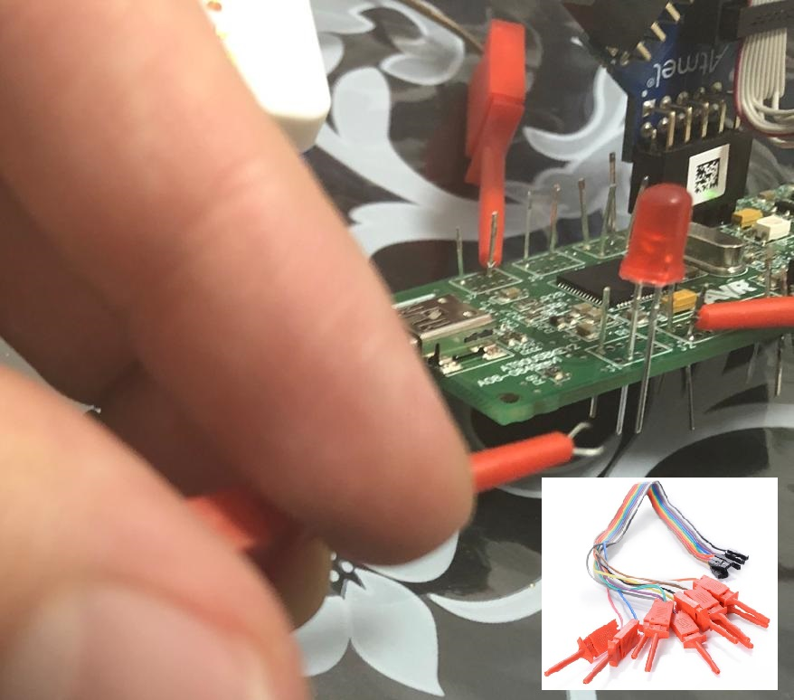

evil mass storage *AT90USBKEY2 (poc-malware-tool for offline system): 

https://github.com/David-Reguera-Garcia-Dreg/evilmass_at90usbkey2/

Just my own adaptation for mass storage sd card and keyboard for AT90USBKEY2.

https://www.avrfreaks.net/forum/mass-storage-sd-card-and-keyboard-at90usbkey2

FatFS + TTL UART + MICRO SD + ATMEL ICE JTAG DEBUGGING


I dont have the correct AT90USBKEY2 pins... but I have leds + clips + tin



ported from Mathieu Sonet lufa-sdcard-mass-storage-demo USB Mass storage on SD card with a Teensy2/ATMEGA32U4 to AT90USBKEY2

https://bitbucket.org/elasticsheep/lufa-sdcard-mass-storage-demo/src/default/ 

ported from LUFA091223 to LUFA170418

http://www.fourwalledcubicle.com/LUFA.php

ported from MMC/SD/SDHC card reader library to FatFS: 

http://www.roland-riegel.de/sd-reader/index.html 

http://elm-chan.org/fsw/ff/00index_e.html

There are two demo projects: 

- LUFA standard DEMO project: lufa-sdcard-mass-storagekeyboard-fatfs-AT90USBKEY2\lufa-sdcard-mass-storagekeyboard-fatfs-AT90USBKEY2\Demos\Device\ClassDriver\MassStorageKeyboard

Already compiled .hex: 

lufa-sdcard-mass-storagekeyboard-fatfs-AT90USBKEY2\lufa-sdcard-mass-storagekeyboard-fatfs-AT90USBKEY2\Demos\Device\ClassDriver\MassStorageKeyboard\MassStorageKeyboard.hex

- Atmel Studio 7 project (for user-friendly JTAG debug): lufa-sdcard-mass-storagekeyboard-fatfs-AT90USBKEY2\mass_storagesd_keyboard_atmel\mass_storagesd_keyboard_atmel.atsln

Already compiled .hex: 

lufa-sdcard-mass-storagekeyboard-fatfs-AT90USBKEY2\mass_storagesd_keyboard_atmel\mass_storagesd_keyboard_atmel\Debug\mass_storagesd_keyboard_atmel.hex

lufa-sdcard-mass-storagekeyboard-fatfs-AT90USBKEY2\mass_storagesd_keyboard_atmel\mass_storagesd_keyboard_atmel\Release\mass_storagesd_keyboard_atmel.hex

--

Windows Prerequisites

copy lufa-sdcard-mass-storagekeyboard-fatfs-AT90USBKEY2 to C:\ 

On Windows, you will need a copy of the latest Atmel Toolchain (http://www.atmel.com/tools/ATMELAVRTOOLCHAINFORWINDOWS.aspx), either downloaded and installed as a standalone package, or installed as part of Atmel Studio. You will need to ensure that the "bin" directory of the toolchain is available in your system's PATH environment variable.

In addition, you will need to install a ported version of the ZSH or BASH *nix shells, and a standard set of *nix utilities such as cut, find and sed. These can be found in the "basic" system package of the of the MinGW installer (http://www.mingw.org). Once installed, add the "msys\1.0\bin" of the MinGW installation folder is added to your system's PATH environment variable.

Linux Prerequisites
On Linux systems you will need to install the latest Linux distribution of the standalone Atmel Toolchain from the Atmel website (http://www.atmel.com/tools/ATMELAVRTOOLCHAINFORLINUX.aspx), or use the latest avr-libc and avr-gcc packages for your chosen distribution's package manager. For full device support, the Atmel standalone Toolchain package is recommended.

---

execute "make all" in: lufa-sdcard-mass-storagekeyboard-fatfs-AT90USBKEY2\Demos\Device\ClassDriver\MassStorageKeyboard

Example of correct output:

```
dreg@DRGWIN /cygdrive/c/lufa-sdcard-mass-storagekeyboard-fatfs-AT90USBKEY2/Demos/Device/ClassDriver/MassStorageKeyboard
$ make all
 [INFO]    : Begin compilation of project "MassStorageKeyboard"...

avr-gcc.exe (WinAVR 20100110) 4.3.3
Copyright (C) 2008 Free Software Foundation, Inc.
This is free software; see the source for copying conditions.  There is NO
warranty; not even for MERCHANTABILITY or FITNESS FOR A PARTICULAR PURPOSE.

 [GCC]     : Compiling C file "MassStorageKeyboard.c"
avr-gcc -c -pipe -gdwarf-2 -g2 -mmcu=at90usb1287 -fshort-enums -fno-inline-small-functions -fpack-struct -Wall -fno-strict-aliasing -funsigned-char -funsigned-bitfields -ffunction-sections -I. -DARCH=ARCH_AVR8 -DF_CPU=8000000UL -mrelax -fno-jump-tables -x c -Os -std=gnu99 -Wstrict-prototypes -DUSE_LUFA_CONFIG_HEADER -IConfig/ -I. -I../../../../LUFA/.. -DARCH=ARCH_AVR8 -DBOARD=BOARD_USBKEY -DF_USB=8000000UL  -MMD -MP -MF obj/MassStorageKeyboard.d MassStorageKeyboard.c -o obj/MassStorageKeyboard.o
 [GCC]     : Compiling C file "Descriptors.c"
avr-gcc -c -pipe -gdwarf-2 -g2 -mmcu=at90usb1287 -fshort-enums -fno-inline-small-functions -fpack-struct -Wall -fno-strict-aliasing -funsigned-char -funsigned-bitfields -ffunction-sections -I. -DARCH=ARCH_AVR8 -DF_CPU=8000000UL -mrelax -fno-jump-tables -x c -Os -std=gnu99 -Wstrict-prototypes -DUSE_LUFA_CONFIG_HEADER -IConfig/ -I. -I../../../../LUFA/.. -DARCH=ARCH_AVR8 -DBOARD=BOARD_USBKEY -DF_USB=8000000UL  -MMD -MP -MF obj/Descriptors.d Descriptors.c -o obj/Descriptors.o
 [GCC]     : Compiling C file "SDCardManager.c"
avr-gcc -c -pipe -gdwarf-2 -g2 -mmcu=at90usb1287 -fshort-enums -fno-inline-small-functions -fpack-struct -Wall -fno-strict-aliasing -funsigned-char -funsigned-bitfields -ffunction-sections -I. -DARCH=ARCH_AVR8 -DF_CPU=8000000UL -mrelax -fno-jump-tables -x c -Os -std=gnu99 -Wstrict-prototypes -DUSE_LUFA_CONFIG_HEADER -IConfig/ -I. -I../../../../LUFA/.. -DARCH=ARCH_AVR8 -DBOARD=BOARD_USBKEY -DF_USB=8000000UL  -MMD -MP -MF obj/SDCardManager.d Lib/SDCardManager.c -o obj/SDCardManager.o
 [GCC]     : Compiling C file "diskio.c"
avr-gcc -c -pipe -gdwarf-2 -g2 -mmcu=at90usb1287 -fshort-enums -fno-inline-small-functions -fpack-struct -Wall -fno-strict-aliasing -funsigned-char -funsigned-bitfields -ffunction-sections -I. -DARCH=ARCH_AVR8 -DF_CPU=8000000UL -mrelax -fno-jump-tables -x c -Os -std=gnu99 -Wstrict-prototypes -DUSE_LUFA_CONFIG_HEADER -IConfig/ -I. -I../../../../LUFA/.. -DARCH=ARCH_AVR8 -DBOARD=BOARD_USBKEY -DF_USB=8000000UL  -MMD -MP -MF obj/diskio.d Lib/diskio.c -o obj/diskio.o
 [GCC]     : Compiling C file "mmc_avr_spi.c"
avr-gcc -c -pipe -gdwarf-2 -g2 -mmcu=at90usb1287 -fshort-enums -fno-inline-small-functions -fpack-struct -Wall -fno-strict-aliasing -funsigned-char -funsigned-bitfields -ffunction-sections -I. -DARCH=ARCH_AVR8 -DF_CPU=8000000UL -mrelax -fno-jump-tables -x c -Os -std=gnu99 -Wstrict-prototypes -DUSE_LUFA_CONFIG_HEADER -IConfig/ -I. -I../../../../LUFA/.. -DARCH=ARCH_AVR8 -DBOARD=BOARD_USBKEY -DF_USB=8000000UL  -MMD -MP -MF obj/mmc_avr_spi.d Lib/mmc_avr_spi.c -o obj/mmc_avr_spi.o
 [GCC]     : Compiling C file "SCSI.c"
avr-gcc -c -pipe -gdwarf-2 -g2 -mmcu=at90usb1287 -fshort-enums -fno-inline-small-functions -fpack-struct -Wall -fno-strict-aliasing -funsigned-char -funsigned-bitfields -ffunction-sections -I. -DARCH=ARCH_AVR8 -DF_CPU=8000000UL -mrelax -fno-jump-tables -x c -Os -std=gnu99 -Wstrict-prototypes -DUSE_LUFA_CONFIG_HEADER -IConfig/ -I. -I../../../../LUFA/.. -DARCH=ARCH_AVR8 -DBOARD=BOARD_USBKEY -DF_USB=8000000UL  -MMD -MP -MF obj/SCSI.d Lib/SCSI.c -o obj/SCSI.o
 [GCC]     : Compiling C file "Serial_AVR8.c"
avr-gcc -c -pipe -gdwarf-2 -g2 -mmcu=at90usb1287 -fshort-enums -fno-inline-small-functions -fpack-struct -Wall -fno-strict-aliasing -funsigned-char -funsigned-bitfields -ffunction-sections -I. -DARCH=ARCH_AVR8 -DF_CPU=8000000UL -mrelax -fno-jump-tables -x c -Os -std=gnu99 -Wstrict-prototypes -DUSE_LUFA_CONFIG_HEADER -IConfig/ -I. -I../../../../LUFA/.. -DARCH=ARCH_AVR8 -DBOARD=BOARD_USBKEY -DF_USB=8000000UL  -MMD -MP -MF obj/Serial_AVR8.d ../../../../LUFA/Drivers/Peripheral/AVR8/Serial_AVR8.c -o obj/Serial_AVR8.o
 [GCC]     : Compiling C file "HIDParser.c"
avr-gcc -c -pipe -gdwarf-2 -g2 -mmcu=at90usb1287 -fshort-enums -fno-inline-small-functions -fpack-struct -Wall -fno-strict-aliasing -funsigned-char -funsigned-bitfields -ffunction-sections -I. -DARCH=ARCH_AVR8 -DF_CPU=8000000UL -mrelax -fno-jump-tables -x c -Os -std=gnu99 -Wstrict-prototypes -DUSE_LUFA_CONFIG_HEADER -IConfig/ -I. -I../../../../LUFA/.. -DARCH=ARCH_AVR8 -DBOARD=BOARD_USBKEY -DF_USB=8000000UL  -MMD -MP -MF obj/HIDParser.d ../../../../LUFA/Drivers/USB/Class/Common/HIDParser.c -o obj/HIDParser.o
 [GCC]     : Compiling C file "Device_AVR8.c"
avr-gcc -c -pipe -gdwarf-2 -g2 -mmcu=at90usb1287 -fshort-enums -fno-inline-small-functions -fpack-struct -Wall -fno-strict-aliasing -funsigned-char -funsigned-bitfields -ffunction-sections -I. -DARCH=ARCH_AVR8 -DF_CPU=8000000UL -mrelax -fno-jump-tables -x c -Os -std=gnu99 -Wstrict-prototypes -DUSE_LUFA_CONFIG_HEADER -IConfig/ -I. -I../../../../LUFA/.. -DARCH=ARCH_AVR8 -DBOARD=BOARD_USBKEY -DF_USB=8000000UL  -MMD -MP -MF obj/Device_AVR8.d ../../../../LUFA/Drivers/USB/Core/AVR8/Device_AVR8.c -o obj/Device_AVR8.o
 [GCC]     : Compiling C file "EndpointStream_AVR8.c"
avr-gcc -c -pipe -gdwarf-2 -g2 -mmcu=at90usb1287 -fshort-enums -fno-inline-small-functions -fpack-struct -Wall -fno-strict-aliasing -funsigned-char -funsigned-bitfields -ffunction-sections -I. -DARCH=ARCH_AVR8 -DF_CPU=8000000UL -mrelax -fno-jump-tables -x c -Os -std=gnu99 -Wstrict-prototypes -DUSE_LUFA_CONFIG_HEADER -IConfig/ -I. -I../../../../LUFA/.. -DARCH=ARCH_AVR8 -DBOARD=BOARD_USBKEY -DF_USB=8000000UL  -MMD -MP -MF obj/EndpointStream_AVR8.d ../../../../LUFA/Drivers/USB/Core/AVR8/EndpointStream_AVR8.c -o obj/EndpointStream_AVR8.o
 [GCC]     : Compiling C file "Endpoint_AVR8.c"
avr-gcc -c -pipe -gdwarf-2 -g2 -mmcu=at90usb1287 -fshort-enums -fno-inline-small-functions -fpack-struct -Wall -fno-strict-aliasing -funsigned-char -funsigned-bitfields -ffunction-sections -I. -DARCH=ARCH_AVR8 -DF_CPU=8000000UL -mrelax -fno-jump-tables -x c -Os -std=gnu99 -Wstrict-prototypes -DUSE_LUFA_CONFIG_HEADER -IConfig/ -I. -I../../../../LUFA/.. -DARCH=ARCH_AVR8 -DBOARD=BOARD_USBKEY -DF_USB=8000000UL  -MMD -MP -MF obj/Endpoint_AVR8.d ../../../../LUFA/Drivers/USB/Core/AVR8/Endpoint_AVR8.c -o obj/Endpoint_AVR8.o
 [GCC]     : Compiling C file "Host_AVR8.c"
avr-gcc -c -pipe -gdwarf-2 -g2 -mmcu=at90usb1287 -fshort-enums -fno-inline-small-functions -fpack-struct -Wall -fno-strict-aliasing -funsigned-char -funsigned-bitfields -ffunction-sections -I. -DARCH=ARCH_AVR8 -DF_CPU=8000000UL -mrelax -fno-jump-tables -x c -Os -std=gnu99 -Wstrict-prototypes -DUSE_LUFA_CONFIG_HEADER -IConfig/ -I. -I../../../../LUFA/.. -DARCH=ARCH_AVR8 -DBOARD=BOARD_USBKEY -DF_USB=8000000UL  -MMD -MP -MF obj/Host_AVR8.d ../../../../LUFA/Drivers/USB/Core/AVR8/Host_AVR8.c -o obj/Host_AVR8.o
 [GCC]     : Compiling C file "PipeStream_AVR8.c"
avr-gcc -c -pipe -gdwarf-2 -g2 -mmcu=at90usb1287 -fshort-enums -fno-inline-small-functions -fpack-struct -Wall -fno-strict-aliasing -funsigned-char -funsigned-bitfields -ffunction-sections -I. -DARCH=ARCH_AVR8 -DF_CPU=8000000UL -mrelax -fno-jump-tables -x c -Os -std=gnu99 -Wstrict-prototypes -DUSE_LUFA_CONFIG_HEADER -IConfig/ -I. -I../../../../LUFA/.. -DARCH=ARCH_AVR8 -DBOARD=BOARD_USBKEY -DF_USB=8000000UL  -MMD -MP -MF obj/PipeStream_AVR8.d ../../../../LUFA/Drivers/USB/Core/AVR8/PipeStream_AVR8.c -o obj/PipeStream_AVR8.o
 [GCC]     : Compiling C file "Pipe_AVR8.c"
avr-gcc -c -pipe -gdwarf-2 -g2 -mmcu=at90usb1287 -fshort-enums -fno-inline-small-functions -fpack-struct -Wall -fno-strict-aliasing -funsigned-char -funsigned-bitfields -ffunction-sections -I. -DARCH=ARCH_AVR8 -DF_CPU=8000000UL -mrelax -fno-jump-tables -x c -Os -std=gnu99 -Wstrict-prototypes -DUSE_LUFA_CONFIG_HEADER -IConfig/ -I. -I../../../../LUFA/.. -DARCH=ARCH_AVR8 -DBOARD=BOARD_USBKEY -DF_USB=8000000UL  -MMD -MP -MF obj/Pipe_AVR8.d ../../../../LUFA/Drivers/USB/Core/AVR8/Pipe_AVR8.c -o obj/Pipe_AVR8.o
 [GCC]     : Compiling C file "USBController_AVR8.c"
avr-gcc -c -pipe -gdwarf-2 -g2 -mmcu=at90usb1287 -fshort-enums -fno-inline-small-functions -fpack-struct -Wall -fno-strict-aliasing -funsigned-char -funsigned-bitfields -ffunction-sections -I. -DARCH=ARCH_AVR8 -DF_CPU=8000000UL -mrelax -fno-jump-tables -x c -Os -std=gnu99 -Wstrict-prototypes -DUSE_LUFA_CONFIG_HEADER -IConfig/ -I. -I../../../../LUFA/.. -DARCH=ARCH_AVR8 -DBOARD=BOARD_USBKEY -DF_USB=8000000UL  -MMD -MP -MF obj/USBController_AVR8.d ../../../../LUFA/Drivers/USB/Core/AVR8/USBController_AVR8.c -o obj/USBController_AVR8.o
 [GCC]     : Compiling C file "USBInterrupt_AVR8.c"
avr-gcc -c -pipe -gdwarf-2 -g2 -mmcu=at90usb1287 -fshort-enums -fno-inline-small-functions -fpack-struct -Wall -fno-strict-aliasing -funsigned-char -funsigned-bitfields -ffunction-sections -I. -DARCH=ARCH_AVR8 -DF_CPU=8000000UL -mrelax -fno-jump-tables -x c -Os -std=gnu99 -Wstrict-prototypes -DUSE_LUFA_CONFIG_HEADER -IConfig/ -I. -I../../../../LUFA/.. -DARCH=ARCH_AVR8 -DBOARD=BOARD_USBKEY -DF_USB=8000000UL  -MMD -MP -MF obj/USBInterrupt_AVR8.d ../../../../LUFA/Drivers/USB/Core/AVR8/USBInterrupt_AVR8.c -o obj/USBInterrupt_AVR8.o
 [GCC]     : Compiling C file "ConfigDescriptors.c"
avr-gcc -c -pipe -gdwarf-2 -g2 -mmcu=at90usb1287 -fshort-enums -fno-inline-small-functions -fpack-struct -Wall -fno-strict-aliasing -funsigned-char -funsigned-bitfields -ffunction-sections -I. -DARCH=ARCH_AVR8 -DF_CPU=8000000UL -mrelax -fno-jump-tables -x c -Os -std=gnu99 -Wstrict-prototypes -DUSE_LUFA_CONFIG_HEADER -IConfig/ -I. -I../../../../LUFA/.. -DARCH=ARCH_AVR8 -DBOARD=BOARD_USBKEY -DF_USB=8000000UL  -MMD -MP -MF obj/ConfigDescriptors.d ../../../../LUFA/Drivers/USB/Core/ConfigDescriptors.c -o obj/ConfigDescriptors.o
 [GCC]     : Compiling C file "DeviceStandardReq.c"
avr-gcc -c -pipe -gdwarf-2 -g2 -mmcu=at90usb1287 -fshort-enums -fno-inline-small-functions -fpack-struct -Wall -fno-strict-aliasing -funsigned-char -funsigned-bitfields -ffunction-sections -I. -DARCH=ARCH_AVR8 -DF_CPU=8000000UL -mrelax -fno-jump-tables -x c -Os -std=gnu99 -Wstrict-prototypes -DUSE_LUFA_CONFIG_HEADER -IConfig/ -I. -I../../../../LUFA/.. -DARCH=ARCH_AVR8 -DBOARD=BOARD_USBKEY -DF_USB=8000000UL  -MMD -MP -MF obj/DeviceStandardReq.d ../../../../LUFA/Drivers/USB/Core/DeviceStandardReq.c -o obj/DeviceStandardReq.o
 [GCC]     : Compiling C file "Events.c"
avr-gcc -c -pipe -gdwarf-2 -g2 -mmcu=at90usb1287 -fshort-enums -fno-inline-small-functions -fpack-struct -Wall -fno-strict-aliasing -funsigned-char -funsigned-bitfields -ffunction-sections -I. -DARCH=ARCH_AVR8 -DF_CPU=8000000UL -mrelax -fno-jump-tables -x c -Os -std=gnu99 -Wstrict-prototypes -DUSE_LUFA_CONFIG_HEADER -IConfig/ -I. -I../../../../LUFA/.. -DARCH=ARCH_AVR8 -DBOARD=BOARD_USBKEY -DF_USB=8000000UL  -MMD -MP -MF obj/Events.d ../../../../LUFA/Drivers/USB/Core/Events.c -o obj/Events.o
 [GCC]     : Compiling C file "HostStandardReq.c"
avr-gcc -c -pipe -gdwarf-2 -g2 -mmcu=at90usb1287 -fshort-enums -fno-inline-small-functions -fpack-struct -Wall -fno-strict-aliasing -funsigned-char -funsigned-bitfields -ffunction-sections -I. -DARCH=ARCH_AVR8 -DF_CPU=8000000UL -mrelax -fno-jump-tables -x c -Os -std=gnu99 -Wstrict-prototypes -DUSE_LUFA_CONFIG_HEADER -IConfig/ -I. -I../../../../LUFA/.. -DARCH=ARCH_AVR8 -DBOARD=BOARD_USBKEY -DF_USB=8000000UL  -MMD -MP -MF obj/HostStandardReq.d ../../../../LUFA/Drivers/USB/Core/HostStandardReq.c -o obj/HostStandardReq.o
 [GCC]     : Compiling C file "USBTask.c"
avr-gcc -c -pipe -gdwarf-2 -g2 -mmcu=at90usb1287 -fshort-enums -fno-inline-small-functions -fpack-struct -Wall -fno-strict-aliasing -funsigned-char -funsigned-bitfields -ffunction-sections -I. -DARCH=ARCH_AVR8 -DF_CPU=8000000UL -mrelax -fno-jump-tables -x c -Os -std=gnu99 -Wstrict-prototypes -DUSE_LUFA_CONFIG_HEADER -IConfig/ -I. -I../../../../LUFA/.. -DARCH=ARCH_AVR8 -DBOARD=BOARD_USBKEY -DF_USB=8000000UL  -MMD -MP -MF obj/USBTask.d ../../../../LUFA/Drivers/USB/Core/USBTask.c -o obj/USBTask.o
 [GCC]     : Compiling C file "AudioClassDevice.c"
avr-gcc -c -pipe -gdwarf-2 -g2 -mmcu=at90usb1287 -fshort-enums -fno-inline-small-functions -fpack-struct -Wall -fno-strict-aliasing -funsigned-char -funsigned-bitfields -ffunction-sections -I. -DARCH=ARCH_AVR8 -DF_CPU=8000000UL -mrelax -fno-jump-tables -x c -Os -std=gnu99 -Wstrict-prototypes -DUSE_LUFA_CONFIG_HEADER -IConfig/ -I. -I../../../../LUFA/.. -DARCH=ARCH_AVR8 -DBOARD=BOARD_USBKEY -DF_USB=8000000UL  -MMD -MP -MF obj/AudioClassDevice.d ../../../../LUFA/Drivers/USB/Class/Device/AudioClassDevice.c -o obj/AudioClassDevice.o
 [GCC]     : Compiling C file "CDCClassDevice.c"
avr-gcc -c -pipe -gdwarf-2 -g2 -mmcu=at90usb1287 -fshort-enums -fno-inline-small-functions -fpack-struct -Wall -fno-strict-aliasing -funsigned-char -funsigned-bitfields -ffunction-sections -I. -DARCH=ARCH_AVR8 -DF_CPU=8000000UL -mrelax -fno-jump-tables -x c -Os -std=gnu99 -Wstrict-prototypes -DUSE_LUFA_CONFIG_HEADER -IConfig/ -I. -I../../../../LUFA/.. -DARCH=ARCH_AVR8 -DBOARD=BOARD_USBKEY -DF_USB=8000000UL  -MMD -MP -MF obj/CDCClassDevice.d ../../../../LUFA/Drivers/USB/Class/Device/CDCClassDevice.c -o obj/CDCClassDevice.o
 [GCC]     : Compiling C file "HIDClassDevice.c"
avr-gcc -c -pipe -gdwarf-2 -g2 -mmcu=at90usb1287 -fshort-enums -fno-inline-small-functions -fpack-struct -Wall -fno-strict-aliasing -funsigned-char -funsigned-bitfields -ffunction-sections -I. -DARCH=ARCH_AVR8 -DF_CPU=8000000UL -mrelax -fno-jump-tables -x c -Os -std=gnu99 -Wstrict-prototypes -DUSE_LUFA_CONFIG_HEADER -IConfig/ -I. -I../../../../LUFA/.. -DARCH=ARCH_AVR8 -DBOARD=BOARD_USBKEY -DF_USB=8000000UL  -MMD -MP -MF obj/HIDClassDevice.d ../../../../LUFA/Drivers/USB/Class/Device/HIDClassDevice.c -o obj/HIDClassDevice.o
 [GCC]     : Compiling C file "MassStorageClassDevice.c"
avr-gcc -c -pipe -gdwarf-2 -g2 -mmcu=at90usb1287 -fshort-enums -fno-inline-small-functions -fpack-struct -Wall -fno-strict-aliasing -funsigned-char -funsigned-bitfields -ffunction-sections -I. -DARCH=ARCH_AVR8 -DF_CPU=8000000UL -mrelax -fno-jump-tables -x c -Os -std=gnu99 -Wstrict-prototypes -DUSE_LUFA_CONFIG_HEADER -IConfig/ -I. -I../../../../LUFA/.. -DARCH=ARCH_AVR8 -DBOARD=BOARD_USBKEY -DF_USB=8000000UL  -MMD -MP -MF obj/MassStorageClassDevice.d ../../../../LUFA/Drivers/USB/Class/Device/MassStorageClassDevice.c -o obj/MassStorageClassDevice.o
 [GCC]     : Compiling C file "MIDIClassDevice.c"
avr-gcc -c -pipe -gdwarf-2 -g2 -mmcu=at90usb1287 -fshort-enums -fno-inline-small-functions -fpack-struct -Wall -fno-strict-aliasing -funsigned-char -funsigned-bitfields -ffunction-sections -I. -DARCH=ARCH_AVR8 -DF_CPU=8000000UL -mrelax -fno-jump-tables -x c -Os -std=gnu99 -Wstrict-prototypes -DUSE_LUFA_CONFIG_HEADER -IConfig/ -I. -I../../../../LUFA/.. -DARCH=ARCH_AVR8 -DBOARD=BOARD_USBKEY -DF_USB=8000000UL  -MMD -MP -MF obj/MIDIClassDevice.d ../../../../LUFA/Drivers/USB/Class/Device/MIDIClassDevice.c -o obj/MIDIClassDevice.o
 [GCC]     : Compiling C file "PrinterClassDevice.c"
avr-gcc -c -pipe -gdwarf-2 -g2 -mmcu=at90usb1287 -fshort-enums -fno-inline-small-functions -fpack-struct -Wall -fno-strict-aliasing -funsigned-char -funsigned-bitfields -ffunction-sections -I. -DARCH=ARCH_AVR8 -DF_CPU=8000000UL -mrelax -fno-jump-tables -x c -Os -std=gnu99 -Wstrict-prototypes -DUSE_LUFA_CONFIG_HEADER -IConfig/ -I. -I../../../../LUFA/.. -DARCH=ARCH_AVR8 -DBOARD=BOARD_USBKEY -DF_USB=8000000UL  -MMD -MP -MF obj/PrinterClassDevice.d ../../../../LUFA/Drivers/USB/Class/Device/PrinterClassDevice.c -o obj/PrinterClassDevice.o
 [GCC]     : Compiling C file "RNDISClassDevice.c"
avr-gcc -c -pipe -gdwarf-2 -g2 -mmcu=at90usb1287 -fshort-enums -fno-inline-small-functions -fpack-struct -Wall -fno-strict-aliasing -funsigned-char -funsigned-bitfields -ffunction-sections -I. -DARCH=ARCH_AVR8 -DF_CPU=8000000UL -mrelax -fno-jump-tables -x c -Os -std=gnu99 -Wstrict-prototypes -DUSE_LUFA_CONFIG_HEADER -IConfig/ -I. -I../../../../LUFA/.. -DARCH=ARCH_AVR8 -DBOARD=BOARD_USBKEY -DF_USB=8000000UL  -MMD -MP -MF obj/RNDISClassDevice.d ../../../../LUFA/Drivers/USB/Class/Device/RNDISClassDevice.c -o obj/RNDISClassDevice.o
 [GCC]     : Compiling C file "AndroidAccessoryClassHost.c"
avr-gcc -c -pipe -gdwarf-2 -g2 -mmcu=at90usb1287 -fshort-enums -fno-inline-small-functions -fpack-struct -Wall -fno-strict-aliasing -funsigned-char -funsigned-bitfields -ffunction-sections -I. -DARCH=ARCH_AVR8 -DF_CPU=8000000UL -mrelax -fno-jump-tables -x c -Os -std=gnu99 -Wstrict-prototypes -DUSE_LUFA_CONFIG_HEADER -IConfig/ -I. -I../../../../LUFA/.. -DARCH=ARCH_AVR8 -DBOARD=BOARD_USBKEY -DF_USB=8000000UL  -MMD -MP -MF obj/AndroidAccessoryClassHost.d ../../../../LUFA/Drivers/USB/Class/Host/AndroidAccessoryClassHost.c -o obj/AndroidAccessoryClassHost.o
 [GCC]     : Compiling C file "AudioClassHost.c"
avr-gcc -c -pipe -gdwarf-2 -g2 -mmcu=at90usb1287 -fshort-enums -fno-inline-small-functions -fpack-struct -Wall -fno-strict-aliasing -funsigned-char -funsigned-bitfields -ffunction-sections -I. -DARCH=ARCH_AVR8 -DF_CPU=8000000UL -mrelax -fno-jump-tables -x c -Os -std=gnu99 -Wstrict-prototypes -DUSE_LUFA_CONFIG_HEADER -IConfig/ -I. -I../../../../LUFA/.. -DARCH=ARCH_AVR8 -DBOARD=BOARD_USBKEY -DF_USB=8000000UL  -MMD -MP -MF obj/AudioClassHost.d ../../../../LUFA/Drivers/USB/Class/Host/AudioClassHost.c -o obj/AudioClassHost.o
 [GCC]     : Compiling C file "CDCClassHost.c"
avr-gcc -c -pipe -gdwarf-2 -g2 -mmcu=at90usb1287 -fshort-enums -fno-inline-small-functions -fpack-struct -Wall -fno-strict-aliasing -funsigned-char -funsigned-bitfields -ffunction-sections -I. -DARCH=ARCH_AVR8 -DF_CPU=8000000UL -mrelax -fno-jump-tables -x c -Os -std=gnu99 -Wstrict-prototypes -DUSE_LUFA_CONFIG_HEADER -IConfig/ -I. -I../../../../LUFA/.. -DARCH=ARCH_AVR8 -DBOARD=BOARD_USBKEY -DF_USB=8000000UL  -MMD -MP -MF obj/CDCClassHost.d ../../../../LUFA/Drivers/USB/Class/Host/CDCClassHost.c -o obj/CDCClassHost.o
 [GCC]     : Compiling C file "HIDClassHost.c"
avr-gcc -c -pipe -gdwarf-2 -g2 -mmcu=at90usb1287 -fshort-enums -fno-inline-small-functions -fpack-struct -Wall -fno-strict-aliasing -funsigned-char -funsigned-bitfields -ffunction-sections -I. -DARCH=ARCH_AVR8 -DF_CPU=8000000UL -mrelax -fno-jump-tables -x c -Os -std=gnu99 -Wstrict-prototypes -DUSE_LUFA_CONFIG_HEADER -IConfig/ -I. -I../../../../LUFA/.. -DARCH=ARCH_AVR8 -DBOARD=BOARD_USBKEY -DF_USB=8000000UL  -MMD -MP -MF obj/HIDClassHost.d ../../../../LUFA/Drivers/USB/Class/Host/HIDClassHost.c -o obj/HIDClassHost.o
 [GCC]     : Compiling C file "MassStorageClassHost.c"
avr-gcc -c -pipe -gdwarf-2 -g2 -mmcu=at90usb1287 -fshort-enums -fno-inline-small-functions -fpack-struct -Wall -fno-strict-aliasing -funsigned-char -funsigned-bitfields -ffunction-sections -I. -DARCH=ARCH_AVR8 -DF_CPU=8000000UL -mrelax -fno-jump-tables -x c -Os -std=gnu99 -Wstrict-prototypes -DUSE_LUFA_CONFIG_HEADER -IConfig/ -I. -I../../../../LUFA/.. -DARCH=ARCH_AVR8 -DBOARD=BOARD_USBKEY -DF_USB=8000000UL  -MMD -MP -MF obj/MassStorageClassHost.d ../../../../LUFA/Drivers/USB/Class/Host/MassStorageClassHost.c -o obj/MassStorageClassHost.o
 [GCC]     : Compiling C file "MIDIClassHost.c"
avr-gcc -c -pipe -gdwarf-2 -g2 -mmcu=at90usb1287 -fshort-enums -fno-inline-small-functions -fpack-struct -Wall -fno-strict-aliasing -funsigned-char -funsigned-bitfields -ffunction-sections -I. -DARCH=ARCH_AVR8 -DF_CPU=8000000UL -mrelax -fno-jump-tables -x c -Os -std=gnu99 -Wstrict-prototypes -DUSE_LUFA_CONFIG_HEADER -IConfig/ -I. -I../../../../LUFA/.. -DARCH=ARCH_AVR8 -DBOARD=BOARD_USBKEY -DF_USB=8000000UL  -MMD -MP -MF obj/MIDIClassHost.d ../../../../LUFA/Drivers/USB/Class/Host/MIDIClassHost.c -o obj/MIDIClassHost.o
 [GCC]     : Compiling C file "PrinterClassHost.c"
avr-gcc -c -pipe -gdwarf-2 -g2 -mmcu=at90usb1287 -fshort-enums -fno-inline-small-functions -fpack-struct -Wall -fno-strict-aliasing -funsigned-char -funsigned-bitfields -ffunction-sections -I. -DARCH=ARCH_AVR8 -DF_CPU=8000000UL -mrelax -fno-jump-tables -x c -Os -std=gnu99 -Wstrict-prototypes -DUSE_LUFA_CONFIG_HEADER -IConfig/ -I. -I../../../../LUFA/.. -DARCH=ARCH_AVR8 -DBOARD=BOARD_USBKEY -DF_USB=8000000UL  -MMD -MP -MF obj/PrinterClassHost.d ../../../../LUFA/Drivers/USB/Class/Host/PrinterClassHost.c -o obj/PrinterClassHost.o
 [GCC]     : Compiling C file "RNDISClassHost.c"
avr-gcc -c -pipe -gdwarf-2 -g2 -mmcu=at90usb1287 -fshort-enums -fno-inline-small-functions -fpack-struct -Wall -fno-strict-aliasing -funsigned-char -funsigned-bitfields -ffunction-sections -I. -DARCH=ARCH_AVR8 -DF_CPU=8000000UL -mrelax -fno-jump-tables -x c -Os -std=gnu99 -Wstrict-prototypes -DUSE_LUFA_CONFIG_HEADER -IConfig/ -I. -I../../../../LUFA/.. -DARCH=ARCH_AVR8 -DBOARD=BOARD_USBKEY -DF_USB=8000000UL  -MMD -MP -MF obj/RNDISClassHost.d ../../../../LUFA/Drivers/USB/Class/Host/RNDISClassHost.c -o obj/RNDISClassHost.o
 [GCC]     : Compiling C file "StillImageClassHost.c"
avr-gcc -c -pipe -gdwarf-2 -g2 -mmcu=at90usb1287 -fshort-enums -fno-inline-small-functions -fpack-struct -Wall -fno-strict-aliasing -funsigned-char -funsigned-bitfields -ffunction-sections -I. -DARCH=ARCH_AVR8 -DF_CPU=8000000UL -mrelax -fno-jump-tables -x c -Os -std=gnu99 -Wstrict-prototypes -DUSE_LUFA_CONFIG_HEADER -IConfig/ -I. -I../../../../LUFA/.. -DARCH=ARCH_AVR8 -DBOARD=BOARD_USBKEY -DF_USB=8000000UL  -MMD -MP -MF obj/StillImageClassHost.d ../../../../LUFA/Drivers/USB/Class/Host/StillImageClassHost.c -o obj/StillImageClassHost.o
 [LNK]     : Linking object files into "MassStorageKeyboard.elf"
avr-gcc obj/MassStorageKeyboard.o obj/Descriptors.o obj/SDCardManager.o obj/diskio.o obj/mmc_avr_spi.o obj/SCSI.o obj/Serial_AVR8.o obj/HIDParser.o obj/Device_AVR8.o obj/EndpointStream_AVR8.o obj/Endpoint_AVR8.o obj/Host_AVR8.o obj/PipeStream_AVR8.o obj/Pipe_AVR8.o obj/USBController_AVR8.o obj/USBInterrupt_AVR8.o obj/ConfigDescriptors.o obj/DeviceStandardReq.o obj/Events.o obj/HostStandardReq.o obj/USBTask.o obj/AudioClassDevice.o obj/CDCClassDevice.o obj/HIDClassDevice.o obj/MassStorageClassDevice.o obj/MIDIClassDevice.o obj/PrinterClassDevice.o obj/RNDISClassDevice.o obj/AndroidAccessoryClassHost.o obj/AudioClassHost.o obj/CDCClassHost.o obj/HIDClassHost.o obj/MassStorageClassHost.o obj/MIDIClassHost.o obj/PrinterClassHost.o obj/RNDISClassHost.o obj/StillImageClassHost.o -o MassStorageKeyboard.elf -lm -Wl,-Map=MassStorageKeyboard.map,--cref -Wl,--gc-sections -Wl,--relax -mmcu=at90usb1287
 [OBJCPY]  : Extracting HEX file data from "MassStorageKeyboard.elf"
avr-objcopy -O ihex -R .eeprom -R .fuse -R .lock -R .signature MassStorageKeyboard.elf MassStorageKeyboard.hex
 [OBJCPY]  : Extracting EEP file data from "MassStorageKeyboard.elf"
avr-objcopy -O ihex -j .eeprom --set-section-flags=.eeprom="alloc,load" --change-section-lma .eeprom=0 --no-change-warnings MassStorageKeyboard.elf MassStorageKeyboard.eep || exit 0
 [OBJCPY]  : Extracting BIN file data from "MassStorageKeyboard.elf"
avr-objcopy -O binary -R .eeprom -R .fuse -R .lock -R .signature MassStorageKeyboard.elf MassStorageKeyboard.bin
 [OBJDMP]  : Extracting LSS file data from "MassStorageKeyboard.elf"
avr-objdump -h -d -S -z MassStorageKeyboard.elf > MassStorageKeyboard.lss
 [NM]      : Extracting SYM file data from "MassStorageKeyboard.elf"
avr-nm -n MassStorageKeyboard.elf > MassStorageKeyboard.sym
 [SIZE]    : Determining size of "MassStorageKeyboard.elf"

avr-size --mcu=at90usb1287 --format=avr MassStorageKeyboard.elf
AVR Memory Usage
----------------
Device: at90usb1287

Program:   13238 bytes (10.1% Full)
(.text + .data + .bootloader)

Data:       1414 bytes (17.3% Full)
(.data + .bss + .noinit)


 [INFO]    : Finished building project "MassStorageKeyboard".

dreg@DRGWIN /cygdrive/c/lufa-sdcard-mass-storagekeyboard-fatfs-AT90USBKEY2/Demos/Device/ClassDriver/MassStorageKeyboard
$
```

